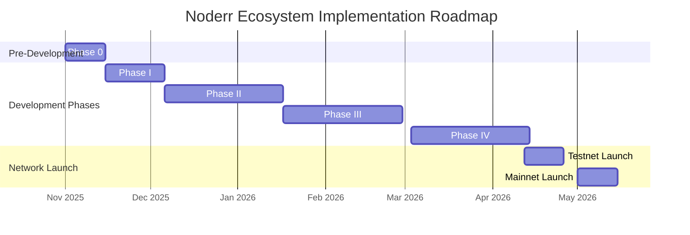

# Noderr Ecosystem: Comprehensive Implementation Roadmap

**Date:** November 9, 2025  
**Phase:** 4 - Build Comprehensive Implementation Roadmap  
**Status:** Complete

---

## 1. Executive Summary

This document outlines a comprehensive, multi-phase implementation roadmap to build and integrate the full Noderr ecosystem. It translates the architectural designs and component analysis into a sequential, actionable plan. The roadmap prioritizes security, stability, and revenue generation by focusing on the **Floor Engine first**, followed by the integration of the more complex **Active Trading Engine (ATE)** and **Strategy Marketplace**.

The timeline is structured into four main development phases, followed by network launch milestones. Each phase includes specific work packages, deliverables, and estimated timelines. This roadmap is a living document and should be updated as the project progresses.

**Guiding Principles:**
- **Quality and Security First:** No compromises on code quality, testing, or security audits.
- **Phased Rollout:** Gradually introduce complexity and risk, starting with the most stable components.
- **Revenue Generation Priority:** The Floor Engine is prioritized to generate yield as early as possible.
- **Modular Development:** Components are built as independent packages to ensure maintainability and scalability.

---

## 2. High-Level Roadmap Overview

---

## 3. Phase I: Smart Contracts & Core Infrastructure (3 Weeks)

**Goal:** Solidify the on-chain foundation and establish the core off-chain services required for all future development.

| Work Package | Tasks | Priority | Deliverable |
| :--- | :--- | :--- | :--- |
| **WP1.1: Smart Contract Fixes** | - Implement all fixes identified in the `COMPREHENSIVE_VERIFICATION_REPORT.md`. - Add missing events and access controls. - Refactor for gas optimization. | **CRITICAL** | Audited and patched v1.1 smart contracts. |
| **WP1.2: On-Chain Service** | - Build the `On-Chain Interaction Service`. - Implement secure hot wallet management. - Whitelist service address in contracts. | **CRITICAL** | A hardened service for all on-chain communication. |
| **WP1.3: Core Capital Flow** | - Implement `requestCapital` & `depositProfit` in the `On-Chain Service`. - Integrate with `TreasuryManager.sol`. - Establish basic performance reporting. | **HIGH** | A functional, secure capital flow between ATE and Treasury. |
| **WP1.4: Codebase Refactor** | - Create the `packages/strategy-manager` package. - Begin moving key `src/` components (adapters, validation) into the `packages/` structure. | **MEDIUM** | A cleaner, more modular codebase adhering to the unified architecture. |

**End-of-Phase Goal:** A secure, audited set of smart contracts and a functional off-chain service capable of managing capital flow with the on-chain Treasury.

---

## 4. Phase II: Floor Engine Implementation (6 Weeks) - PRIORITY

**Goal:** Build and deploy the low-risk yield generation engine to begin generating revenue and testing the core infrastructure.

| Work Package | Tasks | Priority | Deliverable |
| :--- | :--- | :--- | :--- |
| **WP2.1: Orchestrator** | - Build the `FloorEngineOrchestrator` service. - Implement logic for capital allocation between different floor strategies (staking, lending, etc.). | **CRITICAL** | The central control unit for the Floor Engine. |
| **WP2.2: Staking Adapters** | - Build adapters for Lido (ETH), Native ETH, and Base staking. - Integrate adapters with the orchestrator. | **HIGH** | Functional staking capability on key networks. |
| **WP2.3: Lending Adapters** | - Build adapters for Aave v3 and Compound v3. - Integrate adapters with the orchestrator. | **HIGH** | Functional lending capability on key protocols. |
| **WP2.4: Integration** | - Connect the `FloorEngineOrchestrator` to the `On-Chain Interaction Service` for capital management. - Develop a basic monitoring dashboard for Floor Engine performance. | **HIGH** | A fully integrated Floor Engine capable of deploying capital. |
| **WP2.5: Yield Farming** | - Build adapters for Curve and Convex. - Add yield farming strategies to the orchestrator. | **MEDIUM** | Expanded yield generation capabilities. |

**End-of-Phase Goal:** A fully functional and deployed Floor Engine, actively generating yield from staking and lending protocols, with profits being correctly deposited back to the on-chain Treasury.

---

## 5. Phase III: Active Trading Engine (ATE) Integration (6 Weeks)

**Goal:** Integrate the high-risk, high-reward active trading components (`src/`) into the production `packages/` architecture.

| Work Package | Tasks | Priority | Deliverable |
| :--- | :--- | :--- | :--- |
| **WP3.1: CEX/DEX Adapters** | - Build production-ready adapters for Binance, Coinbase, and Uniswap. - Replace all mock connectors with real ones. | **CRITICAL** | Real-world trading connectivity. |
| **WP3.2: `src/` Integration** | - Wrap the `src/` evolution and ML engines as a `StrategyProvider` service. - Integrate the `src/` market regime classifiers into `packages/capital-ai`. | **HIGH** | The ATE can now generate and use its own AI-driven strategies. |
| **WP3.3: Execution Engine** | - Finalize the `SmartOrderRouter` by merging the best logic from `src/` and `packages/`. - Integrate the real CEX/DEX adapters. | **HIGH** | A production-ready execution engine. |
| **WP3.4: Capital Allocation** | - Integrate the `CapitalAI` to dynamically allocate capital between the Floor Engine and the Active Trading Engine. | **HIGH** | A fully autonomous capital allocation system. |

**End-of-Phase Goal:** A fully integrated Autonomous Trading Engine, capable of generating its own strategies, allocating capital dynamically, and executing trades on real exchanges.

---

## 6. Phase IV: Strategy Marketplace & Community (6 Weeks)

**Goal:** Launch the community-facing Strategy Marketplace to decentralize alpha generation.

| Work Package | Tasks | Priority | Deliverable |
| :--- | :--- | :--- | :--- |
| **WP4.1: Submission API** | - Build and deploy the secure, public-facing `Submission API` for community strategies. - Implement authentication and rate limiting. | **CRITICAL** | The entry point for community contributors. |
| **WP4.2: Approval Workflow** | - Build the automated workflow for validating, backtesting, and paper-trading submitted strategies. - Integrate with the `strategy-manager` package. | **HIGH** | An automated, merit-based strategy approval system. |
| **WP4.3: Reward System** | - Build the `RewardCalculator` service. - Integrate with the `RewardDistributor` smart contract using Merkle proofs. | **HIGH** | A system to pay community contributors in NODR. |
| **WP4.4: Security & UI** | - Implement the sandboxed execution environment for community strategies. - Build the front-end UI for the leaderboard, submission portal, and performance dashboards. | **MEDIUM** | A secure and user-friendly marketplace. |

**End-of-Phase Goal:** A live, public Strategy Marketplace where data scientists can submit strategies, compete on a leaderboard, and earn NODR rewards for their performance.

---

## 7. Network Launch Plan

### 7.1. Testnet (2 Weeks)

- **Goal:** End-to-end testing with real assets but limited, permissioned participants.
- **Participants:** Board of directors, core team, close contacts.
- **Checklist:**
    - [ ] Deploy v1.1 smart contracts to a public testnet (e.g., Sepolia).
    - [ ] Run the full, integrated ATE (Floor Engine + Active Trading).
    - [ ] Test capital withdrawal and profit deposit cycles.
    - [ ] Test the Strategy Marketplace submission and reward pipeline with internal users.
    - [ ] Conduct a final security audit of the integrated system.

### 7.2. Mainnet Launch (2 Weeks)

- **Goal:** Go live on mainnet with a phased capital deployment.
- **Initial State:**
    - Deploy audited contracts to Ethereum and Base mainnets.
    - Begin with only the **Floor Engine** enabled.
    - Capital allocation will be conservative and gradually increased.
- **Phased Rollout:**
    1.  **Week 1:** Floor Engine live with 5% of initial AUM.
    2.  **Week 2:** Increase Floor Engine capital to 25% of AUM.
    3.  **Week 3:** Enable the **Active Trading Engine** with a 5% allocation.
    4.  **Week 4:** Enable the **Strategy Marketplace** for public submissions.
    5.  **Ongoing:** Gradually increase capital allocation based on performance and stability, following the `CapitalAI` recommendations.

---

## 8. Cleanup & Documentation (Ongoing)

This is not a phase but an ongoing task throughout the implementation.

- **`VERIFIED_DELETION_LIST.md`:** As `src/` components are refactored and integrated into `packages/`, the old files will be marked for deletion. This list will be maintained to ensure a clean codebase.
- **Documentation Updates:** The whitepaper and all architectural documents will be updated to reflect the final, as-built system.
- **Code Cleanup:** Deprecated code, duplicate files, and unused mocks will be removed from the repository before the mainnet launch.
