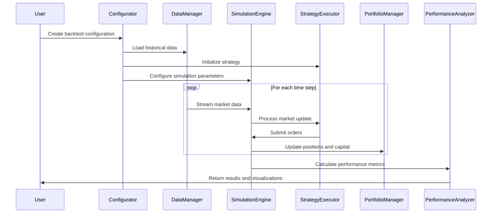
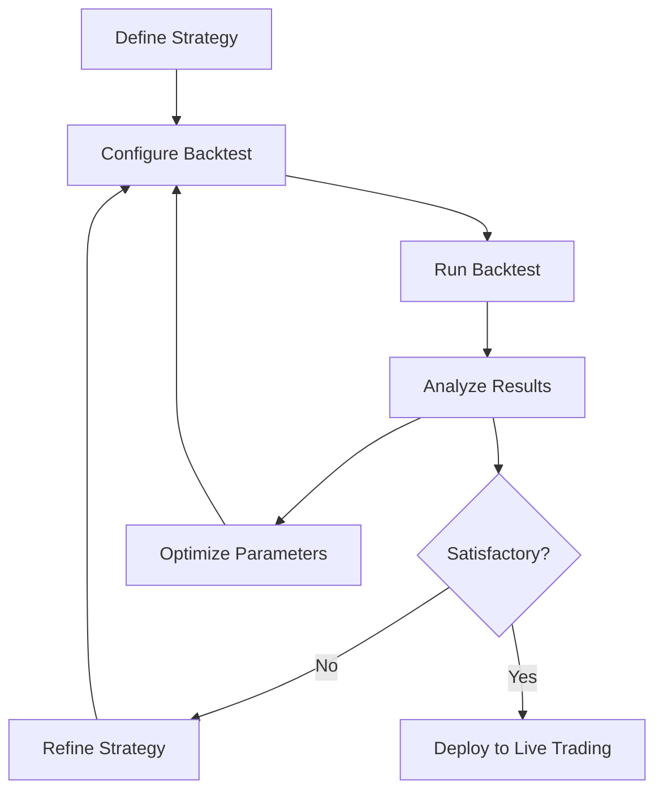
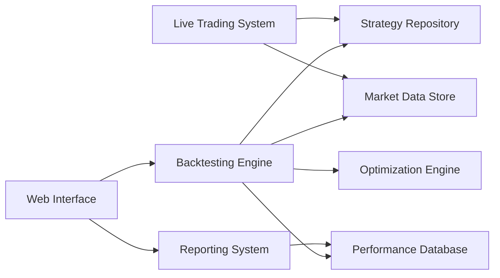

# Noderr Backtesting & Simulation Engine

This document outlines the design of the Noderr Backtesting and Simulation Engine, a critical component for strategy development, testing, and optimization.

## Table of Contents

1. [Requirements](#requirements)
2. [Architecture](#architecture)
3. [Strategy Interface](#strategy-interface)
4. [Historical Data Handling](#historical-data-handling)
5. [Performance Metrics](#performance-metrics)
6. [Implementation Roadmap](#implementation-roadmap)
7. [Appendix](#appendix)

## Requirements

### Core Requirements

| Requirement | Description | Priority |
|-------------|-------------|----------|
| **Accuracy** | Simulation results should closely match real-world behavior | High |
| **Performance** | Process 10+ years of tick-level data in under 1 hour | High |
| **Scalability** | Support parallel execution of multiple backtests | Medium |
| **Extensibility** | Allow custom components (signals, filters, execution models) | High |
| **Reproducibility** | Identical inputs should produce identical outputs | High |

### Feature Requirements

#### Market Simulation Features

| Feature | Description | Priority |
|---------|-------------|----------|
| **Slippage Modeling** | Configurable models: fixed, percentage, market impact | High |
| **Commission Modeling** | Support for tiered fee structures, rebates | High |
| **Liquidity Constraints** | Volume-based execution with partial fills | Medium |
| **Market Impact** | Price impact based on order size relative to available liquidity | Medium |
| **Multi-Asset Simulation** | Correlated price movements across multiple assets | High |
| **Multi-Exchange Simulation** | Cross-exchange arbitrage opportunities | Medium |
| **Market Regime Simulation** | Different volatility, trend, and liquidity scenarios | High |

#### Analysis Features

| Feature | Description | Priority |
|---------|-------------|----------|
| **Parameter Optimization** | Grid search, genetic algorithms, Bayesian optimization | High |
| **Walk-Forward Analysis** | Train on one period, validate on the next | High |
| **Monte Carlo Simulation** | Randomized paths to measure strategy robustness | Medium |
| **Sensitivity Analysis** | Measure impact of varying individual parameters | Medium |
| **Regime Analysis** | Performance across different market conditions | High |
| **Drawdown Analysis** | Detailed metrics on capital drawdown patterns | High |

#### Additional Features

| Feature | Description | Priority |
|---------|-------------|----------|
| **Visualization** | Interactive charts of trades, equity curves, performance metrics | Medium |
| **Reporting** | Detailed PDF/HTML reports with performance analysis | Medium |
| **Event Scheduling** | Simulate market events, news releases | Low |
| **Strategy Comparison** | Side-by-side comparison of multiple strategies | Medium |
| **Benchmark Comparison** | Compare strategy performance against standard benchmarks | High |

### Performance Requirements

| Metric | Requirement |
|--------|-------------|
| **Processing Speed** | Min 1,000,000 price ticks per second on standard hardware |
| **Memory Usage** | Max 8GB RAM for typical backtests |
| **Parallelization** | Scale linearly with added CPU cores |
| **I/O Bandwidth** | Optimize for minimal disk operations |
| **Warmup Period** | Configurable to ensure strategy indicators are properly initialized |

## Architecture

### Component Overview

The backtesting engine follows a modular design with clear separation of concerns:


### Core Components

#### 1. Data Manager

Responsible for loading, preprocessing, and streaming historical market data:

- **Data Loaders**: Adapters for different data sources (CSV, databases, APIs)
- **Data Normalizers**: Standardize data formats from different sources
- **Data Cache**: Optimize repeated access to historical data
- **Data Stream**: Provide time-ordered data to simulation engine

#### 2. Simulation Engine

The central component that processes market data and executes strategy logic:

- **Clock**: Controls the progression of simulation time
- **Event Queue**: Manages time-ordered events (price updates, orders, fills)
- **Market Simulator**: Simulates exchange behavior with order matching
- **Execution Models**: Implements slippage, latency, and fill probability

#### 3. Strategy Executor

Manages strategy instantiation and execution:

- **Strategy Loader**: Instantiates strategy objects from configuration
- **Signal Generator**: Processes strategy logic to generate trade signals
- **Risk Manager**: Applies position sizing and risk controls
- **Order Manager**: Translates signals into market, limit, or other order types

#### 4. Portfolio Manager

Tracks positions, capital, and performs accounting functions:

- **Position Tracker**: Maintains current positions across assets
- **Cash Manager**: Tracks available capital and margin requirements
- **Fee Calculator**: Computes transaction costs based on fee models
- **P&L Calculator**: Calculates realized and unrealized profits/losses

#### 5. Performance Analyzer

Calculates and reports performance metrics:

- **Metrics Calculator**: Computes performance statistics
- **Benchmark Comparator**: Compares strategy performance to benchmarks
- **Drawdown Analyzer**: Analyzes depth and duration of capital drawdowns
- **Risk Metrics**: Calculates risk-adjusted return metrics

#### 6. Optimization Engine

Optimizes strategy parameters to maximize performance:

- **Parameter Space**: Defines the universe of parameter combinations
- **Search Algorithms**: Implements optimization techniques
- **Cross-Validation**: Prevents overfitting with out-of-sample testing
- **Objective Functions**: Customizable optimization targets

#### 7. Results Manager

Manages storage, retrieval, and visualization of backtest results:

- **Storage**: Persists backtest results to databases or files
- **Visualization**: Generates charts and interactive visualizations
- **Reporting**: Creates detailed performance reports
- **Comparison Tools**: Enables comparison between strategy variants

### Component Interactions



## Strategy Interface

Strategies must implement a standard interface to be compatible with the backtesting engine. This ensures consistency and interchangeability of strategy components.

### Core Strategy Interface

```typescript
interface IStrategy {
  // Lifecycle methods
  initialize(context: BacktestContext): void;
  onStart(): void;
  onEnd(): void;
  
  // Market data handlers
  onBar(bar: Bar, context: BacktestContext): void;
  onTick(tick: Tick, context: BacktestContext): void;
  onOrderBook(orderBook: OrderBook, context: BacktestContext): void;
  
  // Order-related callbacks
  onOrderPlaced(order: Order, context: BacktestContext): void;
  onOrderFilled(fill: Fill, context: BacktestContext): void;
  onOrderCancelled(order: Order, context: BacktestContext): void;
  
  // Position and portfolio callbacks
  onPositionChanged(position: Position, context: BacktestContext): void;
  onCashChanged(cash: number, context: BacktestContext): void;
  
  // Optional: custom event handlers
  onCustomEvent(eventType: string, data: any, context: BacktestContext): void;
}
```

### Backtest Context

The context object provides strategy access to the backtesting environment:

```typescript
interface BacktestContext {
  // Current simulation state
  currentTime: Date;
  
  // Data access
  getHistoricalBars(symbol: string, timeframe: Timeframe, lookback: number): Bar[];
  getLastPrice(symbol: string): number;
  
  // Order management
  placeOrder(order: OrderRequest): string; // Returns order ID
  cancelOrder(orderId: string): boolean;
  getOrders(filter?: OrderFilter): Order[];
  
  // Portfolio information
  getPosition(symbol: string): Position;
  getAllPositions(): Position[];
  getPortfolioValue(): number;
  getCash(): number;
  
  // Configuration and parameters
  getParameters(): Map<string, any>;
  
  // Utilities
  log(message: string, level?: LogLevel): void;
  notify(message: string, importance?: NotificationLevel): void;
}
```

### Strategy Configuration

Strategies are configured using a standardized format:

```typescript
interface StrategyConfig {
  // Strategy identification
  id: string;
  name: string;
  version: string;
  
  // Parameters (can be optimized)
  parameters: {
    [key: string]: {
      value: any;
      type: "number" | "boolean" | "string" | "enum";
      range?: [number, number]; // For optimization
      step?: number; // For optimization
      options?: any[]; // For enum types
    }
  };
  
  // Trading universe
  symbols: string[];
  
  // Data requirements
  dataRequirements: {
    timeframes: Timeframe[];
    indicators: string[];
    depth?: number; // For order book data
  };
  
  // Risk management
  riskControls: {
    maxPositionSize?: number | string; // Absolute or percentage
    maxDrawdown?: number; // Percentage
    stopLoss?: number | string; // Points or percentage
    takeProfit?: number | string; // Points or percentage
  };
}
```

### Strategy Development Model

Strategies can be developed using several approaches:

1. **Class-based strategies**: Implement the `IStrategy` interface directly
2. **Function-based strategies**: Provide handler functions for specific events
3. **Rule-based strategies**: Define conditions and actions without coding
4. **Component-based strategies**: Assemble from reusable building blocks

## Historical Data Handling

### Data Sources

The system will support multiple data sources:

| Source Type | Examples | Advantages | Challenges |
|-------------|----------|------------|------------|
| **Local Files** | CSV, JSON, Parquet | Fast access, no network dependency | Limited scope, manual updates |
| **Databases** | InfluxDB, TimescaleDB, MongoDB | Efficient queries, structured storage | Setup complexity, resource usage |
| **Market Data APIs** | CCXT, Alpaca, FMP, Polygon | Comprehensive data, professional-grade | Rate limits, cost, latency |
| **Proprietary Sources** | Internal data, specialized feeds | Unique edge, exclusive information | Integration complexity |

### Data Models

The system will work with standardized data models regardless of the source:

#### OHLCV Bar Data

```typescript
interface Bar {
  symbol: string;
  timestamp: Date;
  open: number;
  high: number;
  low: number;
  close: number;
  volume: number;
  vwap?: number; // Optional volume-weighted average price
  trades?: number; // Optional trade count
}
```

#### Tick Data

```typescript
interface Tick {
  symbol: string;
  timestamp: Date;
  price: number;
  volume: number;
  side?: 'buy' | 'sell'; // Optional trade direction
  exchange?: string; // Optional source exchange
}
```

#### Order Book Data

```typescript
interface OrderBookLevel {
  price: number;
  volume: number;
  orders?: number; // Optional order count
}

interface OrderBook {
  symbol: string;
  timestamp: Date;
  bids: OrderBookLevel[];
  asks: OrderBookLevel[];
  lastUpdateId?: number; // Optional sequence number
}
```

### Data Preprocessing

Data preprocessing ensures quality and consistency:

1. **Cleaning**: Handle missing values, outliers, and erroneous data
2. **Normalization**: Adjust for splits, dividends, and currency conversions
3. **Alignment**: Ensure time series are properly aligned across assets
4. **Augmentation**: Add derived fields (returns, volatility, etc.)
5. **Filtering**: Remove data outside trading hours or specific conditions

### Data Storage Strategy

Optimized storage strategy based on data characteristics:

| Data Type | Storage Strategy | Rationale |
|-----------|-----------------|-----------|
| **OHLCV Data** | Columnar format (Parquet) | Efficient compression, column-oriented queries |
| **Tick Data** | Time-series database | Handle high-volume, time-ordered data |
| **Order Book Snapshots** | Compressed binary format | Efficient storage of complex structures |
| **Derived Indicators** | Cache or compute on-demand | Balance between speed and storage |

### Data Access Patterns

Efficient data access patterns to minimize latency:

1. **Pre-loading**: Load required data into memory before simulation
2. **Windowing**: Maintain sliding windows of relevant historical data
3. **Caching**: Cache frequently accessed data and calculations
4. **Streaming**: Process data sequentially without loading entire datasets
5. **Batch Processing**: Group data operations for efficiency

## Performance Metrics

### Return Metrics

| Metric | Description | Formula |
|--------|-------------|---------|
| **Total Return** | Overall percentage gain/loss | (Final Value / Initial Value) - 1 |
| **Annualized Return** | Return normalized to yearly rate | (1 + Total Return)^(1/Years) - 1 |
| **Periodic Returns** | Daily, weekly, monthly, quarterly | (Current Value / Previous Value) - 1 |
| **Cumulative Returns** | Running total of returns over time | Π(1 + period_return) - 1 |

### Risk Metrics

| Metric | Description | Formula |
|--------|-------------|---------|
| **Volatility** | Standard deviation of returns | σ(periodic_returns) |
| **Downside Deviation** | SD of negative returns only | σ(min(periodic_returns, 0)) |
| **Maximum Drawdown** | Largest peak-to-trough decline | max((peak_value - trough_value) / peak_value) |
| **Value at Risk (VaR)** | Potential loss at confidence level | percentile(returns, 5%) |
| **Conditional VaR** | Expected loss exceeding VaR | mean(returns < VaR) |

### Risk-Adjusted Return Metrics

| Metric | Description | Formula |
|--------|-------------|---------|
| **Sharpe Ratio** | Return per unit of risk | (Strategy Return - Risk Free Rate) / Strategy Volatility |
| **Sortino Ratio** | Return per unit of downside risk | (Strategy Return - Risk Free Rate) / Downside Deviation |
| **Calmar Ratio** | Return per unit of maximum drawdown | Annualized Return / Maximum Drawdown |
| **Omega Ratio** | Probability-weighted ratio of gains vs. losses | ∫(1-F(r))dr / ∫F(r)dr where F is the CDF of returns |
| **Information Ratio** | Active return per unit of tracking risk | (Strategy Return - Benchmark Return) / Tracking Error |

### Trade Metrics

| Metric | Description | Formula |
|--------|-------------|---------|
| **Win Rate** | Percentage of profitable trades | Winning Trades / Total Trades |
| **Profit Factor** | Gross profit / Gross loss | Sum(Profitable Trades) / abs(Sum(Losing Trades)) |
| **Average Trade** | Mean P&L per trade | Sum(Trade P&L) / Total Trades |
| **Expectancy** | Expected P&L per trade | (Win Rate × Average Win) - ((1 - Win Rate) × Average Loss) |
| **Recovery Factor** | Net profit / Maximum drawdown | Net Profit / Maximum Drawdown |

### Exposure Metrics

| Metric | Description | Formula |
|--------|-------------|---------|
| **Average Exposure** | Mean capital utilization | mean(daily_exposure) |
| **Time in Market** | Percentage of time with positions | Days with Positions / Total Days |
| **Concentration** | Distribution of capital across assets | Herfindahl-Hirschman Index of position sizes |

### Advanced Metrics

| Metric | Description |
|--------|-------------|
| **Regime Performance** | Returns across different market regimes (trending, mean-reverting, volatile) |
| **Drawdown Profile** | Distribution and recovery of drawdowns |
| **Factor Exposure** | Sensitivity to common factors (momentum, value, volatility) |
| **Asymmetric Performance** | Upside/downside capture ratios vs benchmark |
| **Maximum Adverse Excursion** | Worst intra-trade drawdown |

## Implementation Roadmap

### Phase 1: Core Engine (1-2 months)

- [x] Define interface specifications and data models
- [ ] Implement the Data Manager component
- [ ] Develop the core Simulation Engine
- [ ] Create basic Strategy Executor
- [ ] Build Portfolio Manager for position tracking
- [ ] Integrate simple Performance Analyzer
- [ ] Develop command-line interface for running backtests

### Phase 2: Advanced Features (2-3 months)

- [ ] Add multiple market simulation models
- [ ] Implement advanced order types and matching algorithms
- [ ] Develop Optimization Engine with grid search
- [ ] Add walk-forward analysis capabilities
- [ ] Integrate visualization components
- [ ] Build basic reporting functionality
- [ ] Add multi-asset and portfolio backtesting

### Phase 3: Performance and Scalability (1-2 months)

- [ ] Optimize code for performance
- [ ] Implement parallel execution of backtests
- [ ] Add distributed computing capabilities
- [ ] Develop caching and data optimization mechanisms
- [ ] Create benchmarking suite for validation
- [ ] Implement incremental backtesting capability

### Phase 4: Advanced Analytics (2-3 months)

- [ ] Add Monte Carlo simulation
- [ ] Implement factor analysis
- [ ] Develop regime detection and analysis
- [ ] Add scenario analysis capabilities
- [ ] Integrate machine learning for parameter optimization
- [ ] Build comprehensive reporting module

### Phase 5: Integration (1-2 months)

- [ ] Integrate with live trading systems
- [ ] Build API for third-party tool integration
- [ ] Create web interface for results analysis
- [ ] Develop strategy repository
- [ ] Add collaboration features
- [ ] Implement version control for strategies and backtests

## Appendix

### A. Performance Benchmarks

| Test Case | Data Size | Expected Performance |
|-----------|-----------|----------------------|
| OHLCV daily data, 10 years, 100 symbols | ~250,000 bars | < 5 seconds |
| OHLCV minute data, 1 year, 10 symbols | ~2,600,000 bars | < 30 seconds |
| Tick data, 1 month, 1 symbol | ~10,000,000 ticks | < 3 minutes |
| Order book data, 1 day, 1 symbol | ~1,000,000 updates | < 5 minutes |

### B. Simulation Models

#### B.1 Slippage Models

1. **Fixed Slippage**: Constant value added to each trade
2. **Percentage Slippage**: Percentage of price applied to each trade
3. **Volume-Based Slippage**: Increases with order size relative to volume
4. **Market Impact Model**: Price impact based on order book depth
5. **Custom Slippage Model**: User-defined function based on market conditions

#### B.2 Execution Models

1. **Immediate Execution**: All orders fill immediately at the next price tick
2. **Order Book Simulation**: Orders matched against simulated order book
3. **Probabilistic Fill Model**: Fill probability based on price, volume, volatility
4. **Latency Model**: Delay between order submission and execution
5. **Smart Routing Model**: Simulates routing across multiple venues

### C. Strategy Examples

```typescript
// Simple Moving Average Crossover Strategy
class MACrossoverStrategy implements IStrategy {
  private fastMA: MovingAverage;
  private slowMA: MovingAverage;
  
  initialize(context: BacktestContext): void {
    const params = context.getParameters();
    this.fastMA = new MovingAverage(params.get('fastPeriod') || 10);
    this.slowMA = new MovingAverage(params.get('slowPeriod') || 50);
  }
  
  onBar(bar: Bar, context: BacktestContext): void {
    const position = context.getPosition(bar.symbol);
    const fastValue = this.fastMA.update(bar.close);
    const slowValue = this.slowMA.update(bar.close);
    
    if (fastValue > slowValue && !position) {
      // Crossover: buy signal
      context.placeOrder({
        symbol: bar.symbol,
        type: 'market',
        side: 'buy',
        quantity: 1,
      });
    } else if (fastValue < slowValue && position) {
      // Crossunder: sell signal
      context.placeOrder({
        symbol: bar.symbol,
        type: 'market',
        side: 'sell',
        quantity: position.quantity,
      });
    }
  }
  
  // Other required interface methods...
}
```

### D. Integration Diagrams

#### D.1 Strategy Development Workflow



#### D.2 System Integration



### E. Validation Methodology

To ensure the backtesting engine produces reliable results:

1. **Historical Replication**: Backtest well-known strategies and compare to published results
2. **Forward Testing**: Test strategies in paper trading with live data
3. **Sensitivity Analysis**: Measure how small changes in inputs affect outputs
4. **Benchmark Comparison**: Compare performance against industry-standard benchmarks
5. **Cross-Validation**: Use different time periods to validate consistency

### F. Glossary

- **Backtest**: Simulation of a trading strategy using historical data
- **Drawdown**: Decline from a peak in the portfolio value
- **Overfitting**: When a strategy is too optimized to past data, losing generalizability
- **Slippage**: Difference between expected price and actual execution price
- **Walk-Forward Analysis**: Testing method that trains on one period and tests on the next
- **Regime**: Distinct market condition or behavior pattern
- **Parameter Optimization**: Process of finding optimal values for strategy parameters
- **Market Impact**: Effect of a trade on the market price
- **Fill Rate**: Percentage of an order that is executed
- **Liquidity**: Ease of buying or selling without causing price impact 