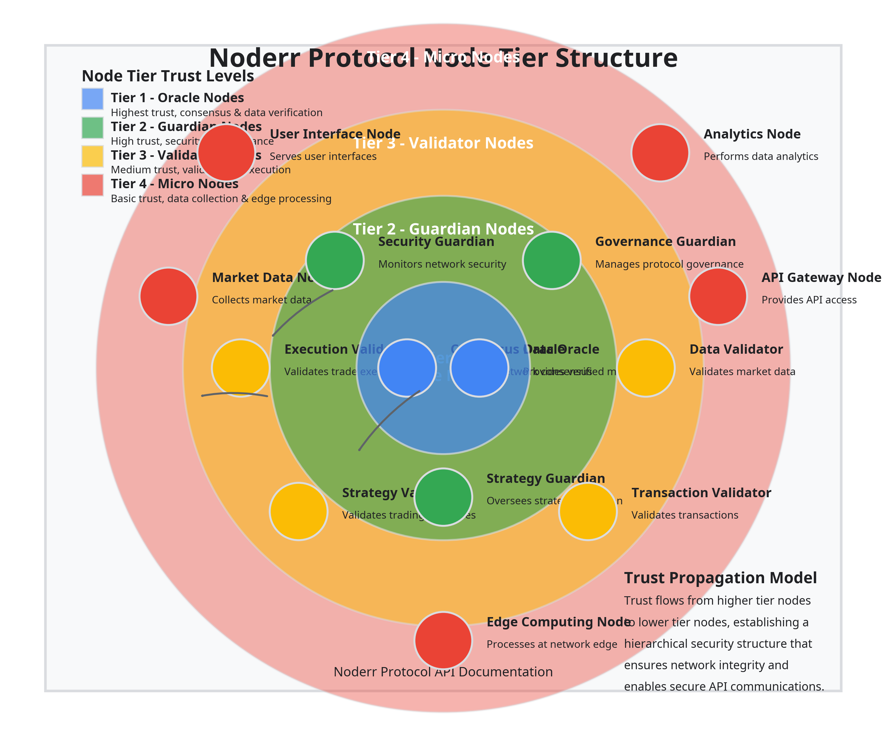

# Part II: Node Structure and Communication

## Node Tier Structure & Responsibilities

The Noderr Protocol implements a hierarchical node structure with four distinct tiers, each with specific responsibilities and trust requirements. This multi-tier approach ensures optimal distribution of computing resources while maintaining security and performance across the network.

### Oracle Nodes

Oracle Nodes represent the highest tier in the Noderr network hierarchy, serving as the primary source of truth and consensus for the entire ecosystem.

#### Responsibilities:
- Consensus and data verification across the network
- Final validation of strategy mutations and evolution
- Management of the core protocol parameters
- Coordination of Guardian Nodes
- Execution of critical system operations

#### Trust Requirements:
- Highest level of trust verification
- Multi-signature security protocols
- Hardware security module integration
- Physical security measures
- Regular security audits and attestations

#### Implementation Pattern:
```rust
/// Oracle Node implementation
pub struct OracleNode {
    /// Cryptographic identity
    identity: NodeIdentity,
    /// Connected Guardian Nodes
    guardians: Vec<NodeConnection<GuardianNode>>,
    /// Strategy verification engine
    verification_engine: StrategyVerificationEngine,
    /// Governance system
    governance: GovernanceSystem,
    /// Dispute resolution system
    dispute_resolver: DisputeResolver,
    /// Network monitoring system
    network_monitor: NetworkMonitor,
}

impl OracleNode {
    /// Connect to a Guardian Node
    pub fn connect_guardian(&mut self, guardian: NodeConnection<GuardianNode>) {
        self.guardians.push(guardian);
    }
    
    /// Verify a trading strategy
    pub fn verify_strategy(&self, strategy: &TradingStrategy) -> VerificationResult {
        self.verification_engine.verify(strategy)
    }
    
    /// Process a governance proposal
    pub fn process_proposal(&mut self, proposal: GovernanceProposal) -> ProposalResult {
        self.governance.process_proposal(proposal)
    }
    
    /// Resolve a dispute
    pub fn resolve_dispute(&self, dispute: Dispute) -> DisputeResolution {
        self.dispute_resolver.resolve(dispute)
    }
    
    /// Monitor network health
    pub fn monitor_network(&self) -> NetworkHealthReport {
        self.network_monitor.generate_report()
    }
}
```

#### API Integration:
Oracle Nodes expose several critical APIs for network operation:

```json
GET /api/v1/oracle/status
{
  "success": true,
  "data": {
    "nodeId": "oracle_9d8c7b6a5f4e3d2c1b",
    "status": "active",
    "connectedGuardians": 12,
    "lastConsensusTimestamp": "2025-04-17T06:47:18Z",
    "currentEpoch": 1423,
    "systemHealth": "optimal"
  },
  "meta": {
    "timestamp": "2025-04-17T06:47:18Z",
    "request_id": "req_7f6e5d4c3b2a1f0e9d"
  }
}
```

### Guardian Nodes

Guardian Nodes form the second tier in the hierarchy, providing security, governance, and oversight for the network.

#### Responsibilities:
- Security monitoring and threat detection
- Strategy oversight and approval
- Governance proposal evaluation
- Resource allocation management
- Oracle Node election and monitoring

#### Trust Requirements:
- High level of trust verification
- Multi-factor authentication
- Secure enclave execution
- Regular security attestations

#### Implementation Pattern:
```rust
/// Guardian Node implementation
pub struct GuardianNode {
    /// Cryptographic identity
    identity: NodeIdentity,
    /// Connected Oracle Nodes
    oracles: Vec<NodeConnection<OracleNode>>,
    /// Connected Validator Nodes
    validators: Vec<NodeConnection<ValidatorNode>>,
    /// Security monitoring system
    security_monitor: SecurityMonitor,
    /// Strategy approval system
    strategy_approver: StrategyApprover,
    /// Resource allocation system
    resource_allocator: ResourceAllocator,
}

impl GuardianNode {
    /// Monitor security threats
    pub fn monitor_security(&self) -> SecurityReport {
        self.security_monitor.generate_report()
    }
    
    /// Approve a strategy for deployment
    pub fn approve_strategy(&self, strategy: &TradingStrategy) -> ApprovalResult {
        self.strategy_approver.approve(strategy)
    }
    
    /// Allocate resources to validators
    pub fn allocate_resources(&mut self, validator: &ValidatorNode, resources: Resources) -> AllocationResult {
        self.resource_allocator.allocate(validator, resources)
    }
}
```

#### API Integration:
Guardian Nodes provide APIs for security monitoring and strategy approval:

```json
POST /api/v1/guardian/strategy/approve
{
  "strategyId": "strategy_7f6e5d4c3b2a1f0e9d",
  "approvalLevel": "production",
  "resourceAllocation": {
    "cpu": 4,
    "memory": 8192,
    "storage": 100,
    "network": "high"
  }
}

Response:
{
  "success": true,
  "data": {
    "approvalId": "approval_3f2e1d0c9b8a7f6e5d",
    "status": "approved",
    "deploymentTarget": "validator_tier_1",
    "effectiveTimestamp": "2025-04-17T07:00:00Z"
  },
  "meta": {
    "timestamp": "2025-04-17T06:47:18Z",
    "request_id": "req_7f6e5d4c3b2a1f0e9d"
  }
}
```

### Validator Nodes

Validator Nodes constitute the third tier, focusing on strategy execution, transaction validation, and data verification.

#### Responsibilities:
- Strategy execution and monitoring
- Transaction validation and verification
- Market data validation
- Performance reporting
- Micro Node coordination

#### Trust Requirements:
- Medium level of trust verification
- Cryptographic identity verification
- Reputation-based trust scoring
- Regular performance audits

#### Implementation Pattern:
```rust
/// Validator Node implementation
pub struct ValidatorNode {
    /// Cryptographic identity
    identity: NodeIdentity,
    /// Connected Guardian Nodes
    guardians: Vec<NodeConnection<GuardianNode>>,
    /// Connected Micro Nodes
    micros: Vec<NodeConnection<MicroNode>>,
    /// Strategy execution engine
    execution_engine: StrategyExecutionEngine,
    /// Transaction validator
    transaction_validator: TransactionValidator,
    /// Market data validator
    market_data_validator: MarketDataValidator,
    /// Performance monitor
    performance_monitor: PerformanceMonitor,
}

impl ValidatorNode {
    /// Execute a trading strategy
    pub fn execute_strategy(&mut self, strategy: &TradingStrategy, market_data: &MarketData) -> ExecutionResult {
        self.execution_engine.execute(strategy, market_data)
    }
    
    /// Validate a transaction
    pub fn validate_transaction(&self, transaction: &Transaction) -> ValidationResult {
        self.transaction_validator.validate(transaction)
    }
    
    /// Validate market data
    pub fn validate_market_data(&self, market_data: &MarketData) -> ValidationResult {
        self.market_data_validator.validate(market_data)
    }
    
    /// Monitor performance
    pub fn monitor_performance(&self) -> PerformanceReport {
        self.performance_monitor.generate_report()
    }
}
```

#### API Integration:
Validator Nodes expose APIs for strategy execution and transaction validation:

```json
POST /api/v1/validator/strategy/execute
{
  "strategyId": "strategy_7f6e5d4c3b2a1f0e9d",
  "marketData": {
    "source": "binance",
    "symbol": "BTC/USDT",
    "timeframe": "1m",
    "timestamp": "2025-04-17T06:47:00Z"
  },
  "executionParameters": {
    "maxSlippage": 0.001,
    "timeoutMs": 500,
    "priorityLevel": "high"
  }
}

Response:
{
  "success": true,
  "data": {
    "executionId": "exec_1a2b3c4d5e6f7g8h9i",
    "status": "completed",
    "signal": {
      "direction": "buy",
      "strength": 0.87,
      "confidence": 0.92
    },
    "transaction": {
      "transactionId": "tx_9i8h7g6f5e4d3c2b1a",
      "status": "confirmed",
      "timestamp": "2025-04-17T06:47:02Z"
    }
  },
  "meta": {
    "timestamp": "2025-04-17T06:47:18Z",
    "request_id": "req_7f6e5d4c3b2a1f0e9d"
  }
}
```

### Micro Nodes

Micro Nodes form the lowest tier, focusing on data collection, edge processing, and network expansion.

#### Responsibilities:
- Market data collection and preprocessing
- Edge computing and local processing
- Network expansion and redundancy
- User interface and application support
- Lightweight strategy execution

#### Trust Requirements:
- Basic level of trust verification
- Cryptographic identity verification
- Limited access to sensitive operations
- Performance-based trust scoring

#### Implementation Pattern:
```rust
/// Micro Node implementation
pub struct MicroNode {
    /// Cryptographic identity
    identity: NodeIdentity,
    /// Connected Validator Nodes
    validators: Vec<NodeConnection<ValidatorNode>>,
    /// Market data collector
    market_data_collector: MarketDataCollector,
    /// Edge processor
    edge_processor: EdgeProcessor,
    /// User interface provider
    ui_provider: UserInterfaceProvider,
}

impl MicroNode {
    /// Collect market data
    pub fn collect_market_data(&mut self, source: &str, symbol: &str) -> MarketData {
        self.market_data_collector.collect(source, symbol)
    }
    
    /// Process data at the edge
    pub fn process_edge(&self, data: &Data) -> ProcessedData {
        self.edge_processor.process(data)
    }
    
    /// Provide user interface
    pub fn provide_ui(&self, user: &User) -> UserInterface {
        self.ui_provider.provide(user)
    }
}
```

#### API Integration:
Micro Nodes provide APIs for data collection and edge processing:

```json
GET /api/v1/micro/market-data/collect
{
  "source": "binance",
  "symbol": "BTC/USDT",
  "timeframe": "1m",
  "limit": 100
}

Response:
{
  "success": true,
  "data": {
    "source": "binance",
    "symbol": "BTC/USDT",
    "timeframe": "1m",
    "candles": [
      {
        "timestamp": "2025-04-17T06:46:00Z",
        "open": 123456.78,
        "high": 123460.00,
        "low": 123450.00,
        "close": 123458.90,
        "volume": 12.34
      },
      // Additional candles...
    ]
  },
  "meta": {
    "timestamp": "2025-04-17T06:47:18Z",
    "request_id": "req_7f6e5d4c3b2a1f0e9d"
  }
}
```

### Node Communication APIs

The Node Communication APIs enable seamless interaction between different tiers of nodes in the Noderr Protocol. These APIs are designed to support the hierarchical trust model while ensuring efficient and secure communication across the network.

#### Node Discovery and Registration

Nodes use these APIs to discover and register with other nodes in the network:

```json
POST /api/v1/node/register
{
  "nodeType": "validator",
  "publicKey": "04a5c9b8d7e6f5a4b3c2d1e0f9a8b7c6d5e4f3a2b1c0d9e8f7a6b5c4d3e2f1a0",
  "capabilities": ["strategy_execution", "transaction_validation", "market_data_validation"],
  "networkAddress": "validator.noderr.network",
  "port": 8443
}

Response:
{
  "success": true,
  "data": {
    "nodeId": "validator_1a2b3c4d5e6f7g8h9i",
    "registrationStatus": "pending",
    "verificationChallenge": "sign_this_message_to_verify_ownership",
    "expiresAt": "2025-04-17T07:47:18Z"
  },
  "meta": {
    "timestamp": "2025-04-17T06:47:18Z",
    "request_id": "req_7f6e5d4c3b2a1f0e9d"
  }
}
```

#### Node Status and Health

These APIs allow nodes to report their status and health metrics:

```json
GET /api/v1/node/status/{nodeId}

Response:
{
  "success": true,
  "data": {
    "nodeId": "validator_1a2b3c4d5e6f7g8h9i",
    "status": "active",
    "uptime": 86400,
    "lastHeartbeat": "2025-04-17T06:47:00Z",
    "currentLoad": {
      "cpu": 0.45,
      "memory": 0.62,
      "network": 0.38,
      "disk": 0.27
    },
    "activeConnections": 24,
    "pendingTasks": 3
  },
  "meta": {
    "timestamp": "2025-04-17T06:47:18Z",
    "request_id": "req_7f6e5d4c3b2a1f0e9d"
  }
}
```

#### Peer-to-Peer Communication

These APIs enable direct communication between nodes:

```json
POST /api/v1/node/message
{
  "recipientNodeId": "validator_1a2b3c4d5e6f7g8h9i",
  "messageType": "strategy_update",
  "priority": "high",
  "payload": {
    "strategyId": "strategy_7f6e5d4c3b2a1f0e9d",
    "version": "1.2.3",
    "updateType": "parameter_adjustment",
    "parameters": {
      "riskTolerance": 0.75,
      "maxDrawdown": 0.05,
      "timeHorizon": 3600
    }
  },
  "signature": "3045022100a1b2c3d4e5f6..."
}

Response:
{
  "success": true,
  "data": {
    "messageId": "msg_9i8h7g6f5e4d3c2b1a",
    "deliveryStatus": "queued",
    "estimatedDeliveryTime": "2025-04-17T06:47:20Z"
  },
  "meta": {
    "timestamp": "2025-04-17T06:47:18Z",
    "request_id": "req_7f6e5d4c3b2a1f0e9d"
  }
}
```



The multi-tier node structure forms the backbone of the Noderr Protocol, enabling a balance of security, performance, and scalability that would not be possible with a flat network topology. By assigning specialized responsibilities to each tier and implementing appropriate trust requirements, the protocol creates a resilient and efficient ecosystem for strategy evolution and execution.
