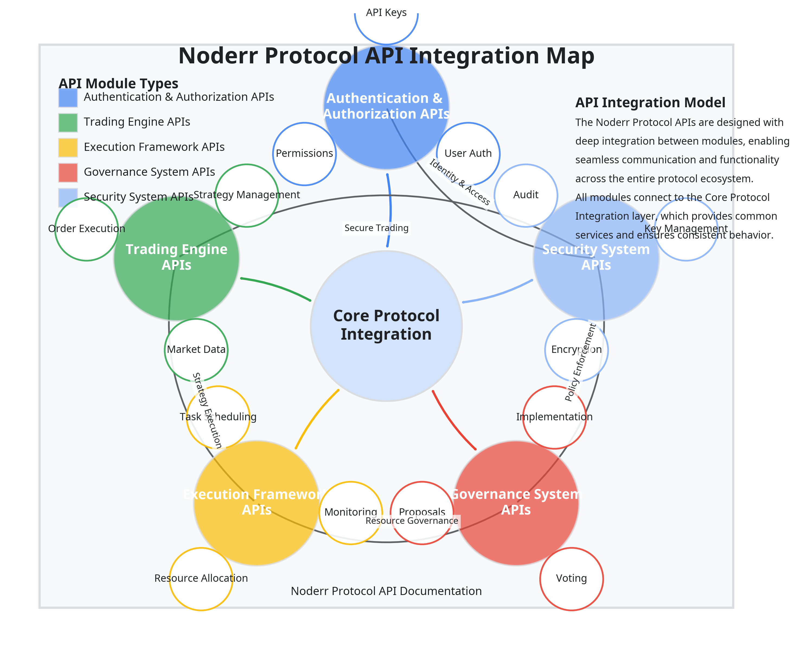

# Part V: Implementation and Extensions

## Data Flow & Communication Architecture

The Data Flow & Communication Architecture is a foundational component of the Noderr Protocol, enabling efficient and reliable information exchange across the distributed network. This section details the data flow patterns, communication protocols, and integration mechanisms that power the protocol's operations.

### Data Flow Patterns

The Data Flow Patterns define how information moves through the Noderr network, ensuring efficient processing and distribution.

#### Core Data Flow Architecture

The Data Flow Architecture implements several key patterns for different types of information:

```rust
/// Data flow manager implementation
pub struct DataFlowManager {
    /// Data router
    data_router: Arc<DataRouter>,
    /// Stream processor
    stream_processor: Arc<StreamProcessor>,
    /// Data transformer
    data_transformer: Arc<DataTransformer>,
    /// Data validator
    data_validator: Arc<DataValidator>,
    /// Flow controller
    flow_controller: Arc<FlowController>,
    /// Data flow event publisher
    event_publisher: Arc<EventPublisher>,
}

impl DataFlowManager {
    /// Process data flow
    pub async fn process_flow(
        &self,
        data: &Data,
        flow_config: &FlowConfiguration
    ) -> Result<ProcessedData, DataFlowError> {
        // Validate data
        self.data_validator.validate(data, &flow_config.validation_rules).await?;
        
        // Transform data
        let transformed_data = self.data_transformer.transform(
            data,
            &flow_config.transformation_rules
        ).await?;
        
        // Route data
        let routing_result = self.data_router.route(
            &transformed_data,
            &flow_config.routing_rules
        ).await?;
        
        // Process data stream if needed
        let processed_data = if flow_config.stream_processing_enabled {
            self.stream_processor.process(
                &routing_result.data,
                &flow_config.stream_processing_rules
            ).await?
        } else {
            routing_result.data
        };
        
        // Control flow rate if needed
        if flow_config.flow_control_enabled {
            self.flow_controller.control_flow(
                &processed_data,
                &flow_config.flow_control_rules
            ).await?;
        }
        
        // Publish data flow event
        self.event_publisher.publish(
            DataFlowEvent::DataProcessed { 
                data_id: processed_data.id.clone(),
                flow_id: flow_config.id.clone(),
                processing_time: Utc::now() - routing_result.start_time,
                data_size: processed_data.size(),
                timestamp: Utc::now(),
            }
        ).await?;
        
        Ok(processed_data)
    }
    
    /// Create data flow
    pub async fn create_flow(
        &self,
        flow_config: FlowConfiguration
    ) -> Result<FlowId, DataFlowError> {
        // Validate flow configuration
        self.validate_flow_configuration(&flow_config).await?;
        
        // Store flow configuration
        let flow_id = self.store_flow_configuration(&flow_config).await?;
        
        // Publish flow created event
        self.event_publisher.publish(
            DataFlowEvent::FlowCreated { 
                flow_id: flow_id.clone(),
                flow_type: flow_config.flow_type.clone(),
                timestamp: Utc::now(),
            }
        ).await?;
        
        Ok(flow_id)
    }
    
    /// Get flow configuration
    pub async fn get_flow_configuration(
        &self,
        flow_id: &FlowId
    ) -> Result<FlowConfiguration, DataFlowError> {
        // Retrieve flow configuration
        let flow_config = self.retrieve_flow_configuration(flow_id).await?;
        
        Ok(flow_config)
    }
    
    /// Update flow configuration
    pub async fn update_flow_configuration(
        &self,
        flow_id: &FlowId,
        flow_config: FlowConfiguration
    ) -> Result<(), DataFlowError> {
        // Validate flow configuration
        self.validate_flow_configuration(&flow_config).await?;
        
        // Update flow configuration
        self.update_stored_flow_configuration(flow_id, &flow_config).await?;
        
        // Publish flow updated event
        self.event_publisher.publish(
            DataFlowEvent::FlowUpdated { 
                flow_id: flow_id.clone(),
                flow_type: flow_config.flow_type.clone(),
                timestamp: Utc::now(),
            }
        ).await?;
        
        Ok(())
    }
    
    /// Delete flow
    pub async fn delete_flow(
        &self,
        flow_id: &FlowId
    ) -> Result<(), DataFlowError> {
        // Delete flow configuration
        self.delete_stored_flow_configuration(flow_id).await?;
        
        // Publish flow deleted event
        self.event_publisher.publish(
            DataFlowEvent::FlowDeleted { 
                flow_id: flow_id.clone(),
                timestamp: Utc::now(),
            }
        ).await?;
        
        Ok(())
    }
}
```

#### API Integration:
The Data Flow Patterns expose APIs for flow configuration and management:

```json
POST /api/v1/data-flow/flow
{
  "name": "Market Data Processing Flow",
  "description": "Process and distribute market data from external sources",
  "flow_type": "market_data",
  "validation_rules": {
    "required_fields": ["symbol", "price", "timestamp"],
    "field_types": {
      "symbol": "string",
      "price": "number",
      "timestamp": "datetime"
    },
    "constraints": {
      "price": {
        "min": 0
      }
    }
  },
  "transformation_rules": [
    {
      "type": "normalize",
      "field": "symbol",
      "parameters": {
        "case": "upper"
      }
    },
    {
      "type": "calculate",
      "output_field": "price_usd",
      "formula": "price * exchange_rate",
      "parameters": {
        "exchange_rate_source": "oracle"
      }
    }
  ],
  "routing_rules": [
    {
      "destination": "trading_engine",
      "condition": "true"
    },
    {
      "destination": "analytics",
      "condition": "price_change_percent > 1.0"
    }
  ],
  "stream_processing_enabled": true,
  "stream_processing_rules": {
    "window_size_seconds": 60,
    "aggregations": [
      {
        "type": "average",
        "field": "price",
        "output_field": "average_price"
      },
      {
        "type": "count",
        "output_field": "update_count"
      }
    ]
  },
  "flow_control_enabled": true,
  "flow_control_rules": {
    "max_throughput_per_second": 1000,
    "burst_size": 100,
    "priority": "high"
  }
}

Response:
{
  "success": true,
  "data": {
    "flow_id": "flow_9i8h7g6f5e4d3c2b1a",
    "status": "active",
    "creation_timestamp": "2025-04-17T08:40:18Z",
    "metrics_url": "/api/v1/data-flow/flow/flow_9i8h7g6f5e4d3c2b1a/metrics"
  },
  "meta": {
    "timestamp": "2025-04-17T08:40:18Z",
    "request_id": "req_7f6e5d4c3b2a1f0e9d"
  }
}
```

### Communication Protocols

The Communication Protocols define the standards and mechanisms for information exchange between nodes in the Noderr network.

#### Protocol Implementation

The protocol implementation supports multiple communication patterns and transport mechanisms:

```rust
/// Communication protocol implementation
pub struct CommunicationProtocol {
    /// Transport layer
    transport: Box<dyn TransportLayer>,
    /// Message serializer
    serializer: Box<dyn MessageSerializer>,
    /// Message validator
    validator: Box<dyn MessageValidator>,
    /// Protocol configuration
    config: ProtocolConfiguration,
    /// Protocol event publisher
    event_publisher: Arc<EventPublisher>,
}

impl CommunicationProtocol {
    /// Send message
    pub async fn send_message(
        &self,
        message: &Message,
        destination: &NodeAddress
    ) -> Result<MessageId, ProtocolError> {
        // Validate message
        self.validator.validate(message)?;
        
        // Serialize message
        let serialized_message = self.serializer.serialize(message)?;
        
        // Send message
        let message_id = self.transport.send(
            &serialized_message,
            destination,
            &self.config.transport_options
        ).await?;
        
        // Publish message sent event
        self.event_publisher.publish(
            ProtocolEvent::MessageSent { 
                message_id: message_id.clone(),
                message_type: message.message_type.clone(),
                destination: destination.clone(),
                size: serialized_message.len(),
                timestamp: Utc::now(),
            }
        ).await?;
        
        Ok(message_id)
    }
    
    /// Receive message
    pub async fn receive_message(&self) -> Result<(Message, NodeAddress), ProtocolError> {
        // Receive serialized message
        let (serialized_message, source) = self.transport.receive().await?;
        
        // Deserialize message
        let message = self.serializer.deserialize(&serialized_message)?;
        
        // Validate message
        self.validator.validate(&message)?;
        
        // Publish message received event
        self.event_publisher.publish(
            ProtocolEvent::MessageReceived { 
                message_id: message.id.clone(),
                message_type: message.message_type.clone(),
                source: source.clone(),
                size: serialized_message.len(),
                timestamp: Utc::now(),
            }
        ).await?;
        
        Ok((message, source))
    }
    
    /// Broadcast message
    pub async fn broadcast_message(
        &self,
        message: &Message,
        destinations: &[NodeAddress]
    ) -> Result<Vec<MessageId>, ProtocolError> {
        // Validate message
        self.validator.validate(message)?;
        
        // Serialize message
        let serialized_message = self.serializer.serialize(message)?;
        
        // Broadcast message
        let message_ids = self.transport.broadcast(
            &serialized_message,
            destinations,
            &self.config.transport_options
        ).await?;
        
        // Publish broadcast event
        self.event_publisher.publish(
            ProtocolEvent::MessageBroadcast { 
                message_type: message.message_type.clone(),
                destination_count: destinations.len(),
                size: serialized_message.len(),
                timestamp: Utc::now(),
            }
        ).await?;
        
        Ok(message_ids)
    }
    
    /// Subscribe to topic
    pub async fn subscribe(
        &self,
        topic: &str,
        handler: Box<dyn Fn(Message) -> Result<(), ProtocolError> + Send + Sync>
    ) -> Result<SubscriptionId, ProtocolError> {
        // Subscribe to topic
        let subscription_id = self.transport.subscribe(
            topic,
            handler,
            &self.config.subscription_options
        ).await?;
        
        // Publish subscription event
        self.event_publisher.publish(
            ProtocolEvent::Subscribed { 
                subscription_id: subscription_id.clone(),
                topic: topic.to_string(),
                timestamp: Utc::now(),
            }
        ).await?;
        
        Ok(subscription_id)
    }
    
    /// Unsubscribe from topic
    pub async fn unsubscribe(
        &self,
        subscription_id: &SubscriptionId
    ) -> Result<(), ProtocolError> {
        // Unsubscribe from topic
        self.transport.unsubscribe(subscription_id).await?;
        
        // Publish unsubscription event
        self.event_publisher.publish(
            ProtocolEvent::Unsubscribed { 
                subscription_id: subscription_id.clone(),
                timestamp: Utc::now(),
            }
        ).await?;
        
        Ok(())
    }
}
```

#### Message Types Implementation

```rust
/// Message types implementation
pub enum MessageType {
    /// Request message
    Request {
        /// Request ID
        request_id: RequestId,
        /// Request type
        request_type: RequestType,
        /// Request parameters
        parameters: HashMap<String, Value>,
    },
    /// Response message
    Response {
        /// Request ID
        request_id: RequestId,
        /// Response status
        status: ResponseStatus,
        /// Response data
        data: Option<Value>,
        /// Error details
        error: Option<ErrorDetails>,
    },
    /// Event message
    Event {
        /// Event type
        event_type: EventType,
        /// Event data
        data: Value,
    },
    /// Command message
    Command {
        /// Command type
        command_type: CommandType,
        /// Command parameters
        parameters: HashMap<String, Value>,
        /// Authorization token
        authorization: Option<String>,
    },
    /// Data message
    Data {
        /// Data type
        data_type: DataType,
        /// Data content
        content: Vec<u8>,
        /// Metadata
        metadata: HashMap<String, Value>,
    },
}

/// Message implementation
pub struct Message {
    /// Message ID
    pub id: MessageId,
    /// Message type
    pub message_type: MessageType,
    /// Sender node ID
    pub sender: NodeId,
    /// Recipient node ID
    pub recipient: Option<NodeId>,
    /// Message priority
    pub priority: MessagePriority,
    /// Creation timestamp
    pub creation_time: DateTime<Utc>,
    /// Expiration timestamp
    pub expiration_time: Option<DateTime<Utc>>,
    /// Message signature
    pub signature: Option<Signature>,
}
```

#### API Integration:
The Communication Protocols expose APIs for message management and monitoring:

```json
GET /api/v1/communication/messages
{
  "message_type": "event",
  "timeframe": "1h",
  "limit": 10,
  "offset": 0
}

Response:
{
  "success": true,
  "data": {
    "messages": [
      {
        "message_id": "msg_9i8h7g6f5e4d3c2b1a",
        "message_type": "event",
        "event_type": "strategy_evolved",
        "sender": "oracle_9d8c7b6a5f4e3d2c1b",
        "recipients": [
          "guardian_8c7b6a5f4e3d2c1b9a",
          "guardian_7b6a5f4e3d2c1b9a8c"
        ],
        "priority": "high",
        "creation_time": "2025-04-17T08:30:18Z",
        "delivery_status": "delivered",
        "size_bytes": 2456
      },
      // Additional messages...
    ],
    "total_messages": 42,
    "message_summary": {
      "by_type": {
        "request": 15,
        "response": 15,
        "event": 8,
        "command": 3,
        "data": 1
      },
      "by_priority": {
        "high": 12,
        "medium": 25,
        "low": 5
      }
    }
  },
  "meta": {
    "timestamp": "2025-04-17T08:45:18Z",
    "request_id": "req_7f6e5d4c3b2a1f0e9d"
  }
}
```

### Integration Mechanisms

The Integration Mechanisms enable seamless interaction between the Noderr Protocol and external systems, including exchanges, data providers, and third-party applications.

#### Integration Manager Implementation

```rust
/// Integration manager implementation
pub struct IntegrationManager {
    /// Integration repository
    integration_repository: Arc<IntegrationRepository>,
    /// Adapter factory
    adapter_factory: Arc<AdapterFactory>,
    /// Transformation engine
    transformation_engine: Arc<TransformationEngine>,
    /// Authentication manager
    authentication_manager: Arc<AuthenticationManager>,
    /// Integration event publisher
    event_publisher: Arc<EventPublisher>,
}

impl IntegrationManager {
    /// Create integration
    pub async fn create_integration(
        &self,
        integration: Integration
    ) -> Result<IntegrationId, IntegrationError> {
        // Validate integration
        self.validate_integration(&integration).await?;
        
        // Create adapter
        let adapter = self.adapter_factory.create_adapter(&integration.adapter_type)?;
        
        // Test connection
        adapter.test_connection(&integration.connection_parameters).await?;
        
        // Store integration
        let integration_id = self.integration_repository.store(&integration).await?;
        
        // Publish integration created event
        self.event_publisher.publish(
            IntegrationEvent::IntegrationCreated { 
                integration_id: integration_id.clone(),
                integration_type: integration.integration_type.clone(),
                adapter_type: integration.adapter_type.clone(),
                timestamp: Utc::now(),
            }
        ).await?;
        
        Ok(integration_id)
    }
    
    /// Get integration
    pub async fn get_integration(
        &self,
        integration_id: &IntegrationId
    ) -> Result<Integration, IntegrationError> {
        self.integration_repository.get(integration_id).await
    }
    
    /// Update integration
    pub async fn update_integration(
        &self,
        integration_id: &IntegrationId,
        integration: Integration
    ) -> Result<(), IntegrationError> {
        // Validate integration
        self.validate_integration(&integration).await?;
        
        // Create adapter
        let adapter = self.adapter_factory.create_adapter(&integration.adapter_type)?;
        
        // Test connection
        adapter.test_connection(&integration.connection_parameters).await?;
        
        // Update integration
        self.integration_repository.update(integration_id, &integration).await?;
        
        // Publish integration updated event
        self.event_publisher.publish(
            IntegrationEvent::IntegrationUpdated { 
                integration_id: integration_id.clone(),
                integration_type: integration.integration_type.clone(),
                adapter_type: integration.adapter_type.clone(),
                timestamp: Utc::now(),
            }
        ).await?;
        
        Ok(())
    }
    
    /// Delete integration
    pub async fn delete_integration(
        &self,
        integration_id: &IntegrationId
    ) -> Result<(), IntegrationError> {
        // Delete integration
        self.integration_repository.delete(integration_id).await?;
        
        // Publish integration deleted event
        self.event_publisher.publish(
            IntegrationEvent::IntegrationDeleted { 
                integration_id: integration_id.clone(),
                timestamp: Utc::now(),
            }
        ).await?;
        
        Ok(())
    }
    
    /// Execute integration operation
    pub async fn execute_operation(
        &self,
        integration_id: &IntegrationId,
        operation: &str,
        parameters: &HashMap<String, Value>
    ) -> Result<Value, IntegrationError> {
        // Get integration
        let integration = self.integration_repository.get(integration_id).await?;
        
        // Create adapter
        let adapter = self.adapter_factory.create_adapter(&integration.adapter_type)?;
        
        // Authenticate
        let auth_context = self.authentication_manager.authenticate(
            &integration.authentication_parameters
        ).await?;
        
        // Execute operation
        let result = adapter.execute_operation(
            operation,
            parameters,
            &auth_context,
            &integration.connection_parameters
        ).await?;
        
        // Transform result if needed
        let transformed_result = if let Some(transformation) = integration.result_transformation.get(operation) {
            self.transformation_engine.transform(&result, transformation).await?
        } else {
            result
        };
        
        // Publish operation executed event
        self.event_publisher.publish(
            IntegrationEvent::OperationExecuted { 
                integration_id: integration_id.clone(),
                operation: operation.to_string(),
                timestamp: Utc::now(),
            }
        ).await?;
        
        Ok(transformed_result)
    }
}
```

#### Exchange Integration Implementation

```python
# Python implementation of exchange integration
class ExchangeAdapter:
    def __init__(self, config):
        self.config = config
        self.exchange_clients = {}
        self.rate_limiters = {}
        self.order_mappers = {}
        self.market_data_mappers = {}
    
    async def initialize(self):
        """Initialize exchange adapter."""
        for exchange_id, exchange_config in self.config.exchanges.items():
            # Create exchange client
            client = self._create_exchange_client(exchange_id, exchange_config)
            self.exchange_clients[exchange_id] = client
            
            # Create rate limiter
            rate_limiter = RateLimiter(
                max_requests=exchange_config.rate_limits.max_requests,
                time_window_seconds=exchange_config.rate_limits.time_window_seconds,
                burst_size=exchange_config.rate_limits.burst_size
            )
            self.rate_limiters[exchange_id] = rate_limiter
            
            # Create mappers
            self.order_mappers[exchange_id] = OrderMapper(exchange_config.order_mapping)
            self.market_data_mappers[exchange_id] = MarketDataMapper(exchange_config.market_data_mapping)
    
    async def get_market_data(self, exchange_id, symbol, timeframe=None):
        """Get market data from exchange."""
        # Check if exchange is supported
        if exchange_id not in self.exchange_clients:
            raise ExchangeAdapterError(f"Unsupported exchange: {exchange_id}")
        
        # Get exchange client and rate limiter
        client = self.exchange_clients[exchange_id]
        rate_limiter = self.rate_limiters[exchange_id]
        
        # Wait for rate limit
        await rate_limiter.acquire()
        
        try:
            # Get market data from exchange
            raw_market_data = await client.get_market_data(symbol, timeframe)
            
            # Map market data to standard format
            mapper = self.market_data_mappers[exchange_id]
            standardized_market_data = mapper.map_to_standard(raw_market_data)
            
            return standardized_market_data
        except Exception as e:
            raise ExchangeAdapterError(f"Failed to get market data: {str(e)}")
    
    async def place_order(self, exchange_id, order):
        """Place order on exchange."""
        # Check if exchange is supported
        if exchange_id not in self.exchange_clients:
            raise ExchangeAdapterError(f"Unsupported exchange: {exchange_id}")
        
        # Get exchange client and rate limiter
        client = self.exchange_clients[exchange_id]
        rate_limiter = self.rate_limiters[exchange_id]
        
        # Map order to exchange format
        mapper = self.order_mappers[exchange_id]
        exchange_order = mapper.map_to_exchange(order)
        
        # Wait for rate limit
        await rate_limiter.acquire()
        
        try:
            # Place order on exchange
            raw_order_result = await client.place_order(exchange_order)
            
            # Map order result to standard format
            standardized_order_result = mapper.map_result_to_standard(raw_order_result)
            
            return standardized_order_result
        except Exception as e:
            raise ExchangeAdapterError(f"Failed to place order: {str(e)}")
    
    async def cancel_order(self, exchange_id, order_id):
        """Cancel order on exchange."""
        # Check if exchange is supported
        if exchange_id not in self.exchange_clients:
            raise ExchangeAdapterError(f"Unsupported exchange: {exchange_id}")
        
        # Get exchange client and rate limiter
        client = self.exchange_clients[exchange_id]
        rate_limiter = self.rate_limiters[exchange_id]
        
        # Wait for rate limit
        await rate_limiter.acquire()
        
        try:
            # Cancel order on exchange
            raw_cancel_result = await client.cancel_order(order_id)
            
            # Map cancel result to standard format
            mapper = self.order_mappers[exchange_id]
            standardized_cancel_result = mapper.map_cancel_result_to_standard(raw_cancel_result)
            
            return standardized_cancel_result
        except Exception as e:
            raise ExchangeAdapterError(f"Failed to cancel order: {str(e)}")
    
    async def get_order_status(self, exchange_id, order_id):
        """Get order status from exchange."""
        # Check if exchange is supported
        if exchange_id not in self.exchange_clients:
            raise ExchangeAdapterError(f"Unsupported exchange: {exchange_id}")
        
        # Get exchange client and rate limiter
        client = self.exchange_clients[exchange_id]
        rate_limiter = self.rate_limiters[exchange_id]
        
        # Wait for rate limit
        await rate_limiter.acquire()
        
        try:
            # Get order status from exchange
            raw_order_status = await client.get_order_status(order_id)
            
            # Map order status to standard format
            mapper = self.order_mappers[exchange_id]
            standardized_order_status = mapper.map_status_to_standard(raw_order_status)
            
            return standardized_order_status
        except Exception as e:
            raise ExchangeAdapterError(f"Failed to get order status: {str(e)}")
```

#### API Integration:
The Integration Mechanisms expose APIs for integration management and operation:

```json
POST /api/v1/integration
{
  "name": "Binance Integration",
  "description": "Integration with Binance exchange for market data and trading",
  "integration_type": "exchange",
  "adapter_type": "binance",
  "connection_parameters": {
    "api_url": "https://api.binance.com",
    "websocket_url": "wss://stream.binance.com:9443",
    "timeout_ms": 5000
  },
  "authentication_parameters": {
    "auth_type": "api_key",
    "api_key": "YOUR_API_KEY",
    "api_secret": "YOUR_API_SECRET"
  },
  "operation_parameters": {
    "get_market_data": {
      "default_timeframe": "1m",
      "max_candles": 1000
    },
    "place_order": {
      "default_time_in_force": "GTC",
      "default_order_type": "LIMIT"
    }
  },
  "result_transformation": {
    "get_market_data": {
      "field_mapping": {
        "o": "open",
        "h": "high",
        "l": "low",
        "c": "close",
        "v": "volume",
        "t": "timestamp"
      },
      "transformations": [
        {
          "type": "timestamp",
          "field": "timestamp",
          "from_format": "milliseconds",
          "to_format": "iso8601"
        }
      ]
    }
  }
}

Response:
{
  "success": true,
  "data": {
    "integration_id": "integration_9i8h7g6f5e4d3c2b1a",
    "status": "active",
    "creation_timestamp": "2025-04-17T08:50:18Z",
    "available_operations": [
      "get_market_data",
      "place_order",
      "cancel_order",
      "get_order_status",
      "get_account_balance"
    ]
  },
  "meta": {
    "timestamp": "2025-04-17T08:50:18Z",
    "request_id": "req_7f6e5d4c3b2a1f0e9d"
  }
}
```

### Data Flow & Communication APIs

The Data Flow & Communication system exposes a comprehensive set of APIs for data management, messaging, and integration:

#### Data Streaming APIs

These APIs enable real-time data streaming and processing:

```json
POST /api/v1/data-flow/stream
{
  "stream_name": "market_data_stream",
  "description": "Real-time market data stream for BTC/USDT",
  "data_source": {
    "type": "exchange",
    "integration_id": "integration_9i8h7g6f5e4d3c2b1a",
    "parameters": {
      "symbol": "BTC/USDT",
      "timeframe": "1m"
    }
  },
  "processing_steps": [
    {
      "type": "filter",
      "condition": "volume > 1.0"
    },
    {
      "type": "transform",
      "transformations": [
        {
          "type": "calculate",
          "output_field": "price_change_percent",
          "formula": "(close - open) / open * 100"
        }
      ]
    },
    {
      "type": "enrich",
      "enrichment_source": {
        "type": "oracle",
        "parameters": {
          "data_type": "sentiment"
        }
      },
      "mapping": {
        "symbol": "asset"
      }
    }
  ],
  "output": {
    "destinations": [
      {
        "type": "trading_engine",
        "parameters": {
          "strategy_id": "strategy_1a2b3c4d5e6f7g8h9i"
        }
      },
      {
        "type": "websocket",
        "parameters": {
          "channel": "market_data",
          "access_control": {
            "required_roles": ["trader", "analyst"]
          }
        }
      }
    ],
    "format": "json",
    "compression": "none"
  },
  "performance": {
    "priority": "high",
    "max_latency_ms": 100,
    "buffer_size": 1000
  }
}

Response:
{
  "success": true,
  "data": {
    "stream_id": "stream_9i8h7g6f5e4d3c2b1a",
    "status": "active",
    "creation_timestamp": "2025-04-17T08:55:18Z",
    "websocket_url": "wss://api.noderr.network/ws/stream_9i8h7g6f5e4d3c2b1a",
    "metrics_url": "/api/v1/data-flow/stream/stream_9i8h7g6f5e4d3c2b1a/metrics"
  },
  "meta": {
    "timestamp": "2025-04-17T08:55:18Z",
    "request_id": "req_7f6e5d4c3b2a1f0e9d"
  }
}
```



The Data Flow & Communication Architecture is a foundational component of the Noderr Protocol, enabling efficient and reliable information exchange across the distributed network. Through its Data Flow Patterns, Communication Protocols, and Integration Mechanisms, this architecture ensures seamless interaction between all components of the protocol and with external systems.
